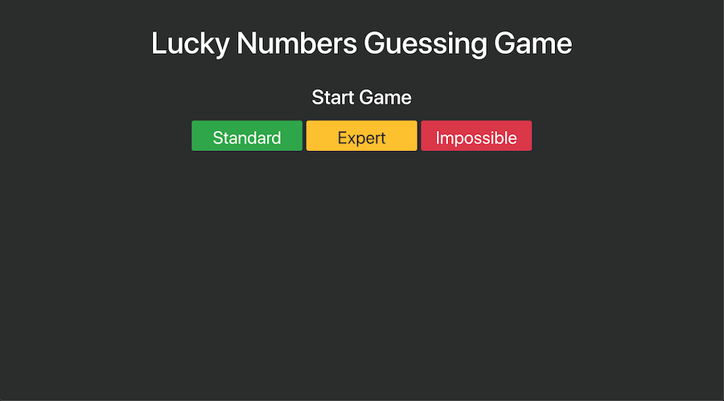
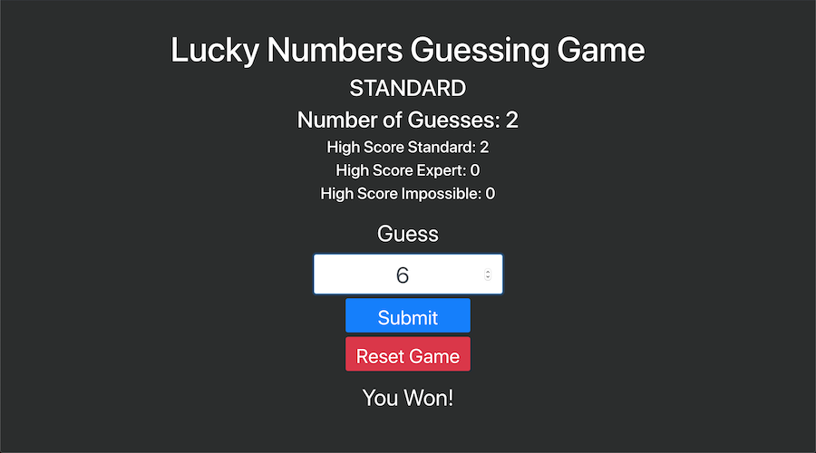
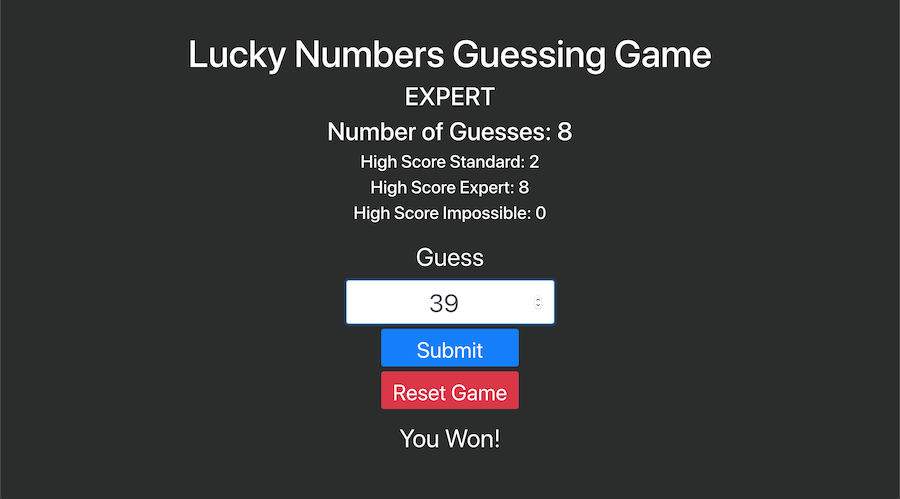
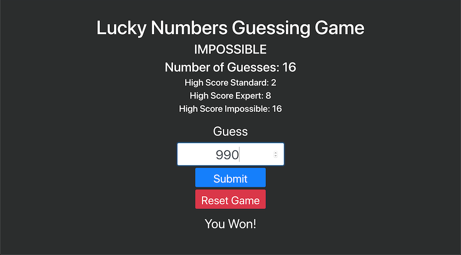

# Guess the Number Game
This react app uses two basic components to create a fun guessing game with three different levels Standard, Expert, and Impossible. Depending on the level a random number is generated. Standard is between 1 and 10. Expert is between 1 and 100. Impossible is between 1 and 1000. 

## Play the Game
[Game](https://react-number-guessing-game.netlify.com)


## Screenshots

### Start Game



### Standard



### Expert



### Impossible



## Getting Started
To be able to use this app you run
```bash
npm install
```
this should install the necessary node_modules. Afterwards run
```bash
npm start
```
to start the app and play the game! Have fun!

## License
[MIT](https://choosealicense.com/licenses/mit/)

